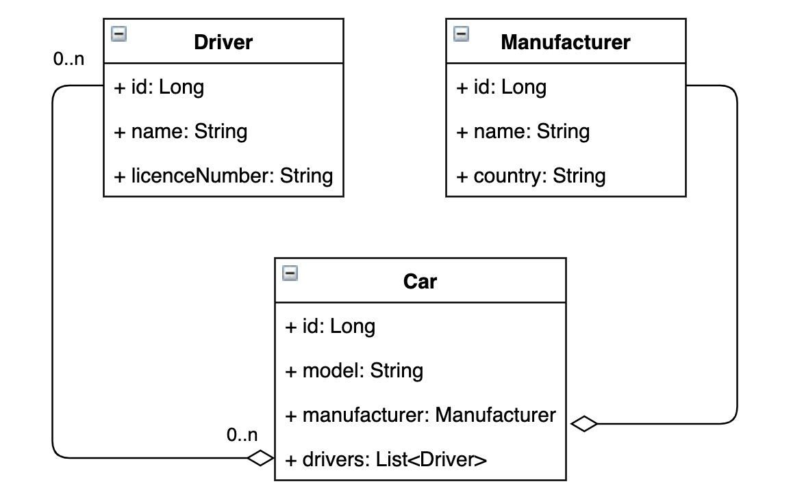

# Taxi manager 

Web application with a basic UI interface which simulates taxi service work.
##### 
Try to use on Heroku - <a href="https://taxi-app-1.herokuapp.com/index">Taxi manager</a>

## Content
- [Description of features](#description)
- [Model structure](#model-structure)
- [Technologies](#technologies)
- [How to run](#how-to-run)

## Description of features
[content](#content)
- register a new driver
- log in, log out
- add manufacturer, car
- add a new driver to the car
- display a list of drivers with the ability to delete
- display a list of manufacturers with the ability to delete
- display a list of cars
- display a list of cars of an authenticated driver

## Model structure
[content](#content)

## Technologies
[content](#content)
- Java 11
- Java Servlet API
- Java Database Connectivity (JDBC)
- MySQL
- Maven
- Tomcat

## How to run
[content](#content)
- Fill (real variables names in ConnectionUtil) to ConnectionUtil.
- Initialize DB using init_db.sql file.
- Configure Tomcat
- Launch the project
